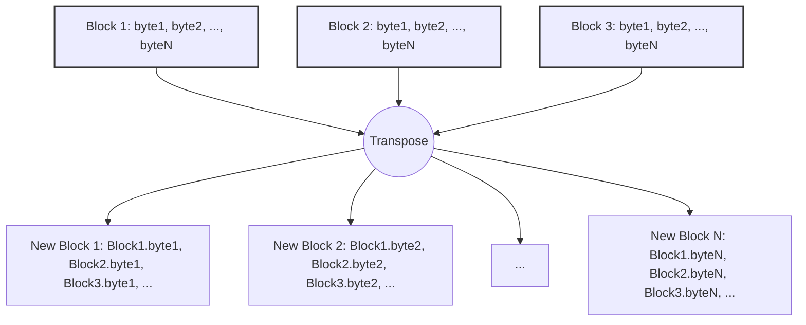

# XORacle

XORacle is a tool designed to decrypt data encoded with a repeating-key XOR
cipher. Utilizing brute-force methods alongside transposition and frequency
analysis techniques, XORacle will attempt to deduce the key size and the key
itself.

This project is dockerized and gets deployed to Google Cloud Run.
[View Hosted Site](https://xoracle-uzphfx7uwa-ue.a.run.app)

## ToDo

- [x] Clear the output on each request
- [x] Rate limiting
- [ ] Better HTMX errors
- [ ] More tests
- [x] Use the new ServeMux in Go 1.22 to replace Chi
- [x] Semver versioning

## Features

- **Automatic Key Size Detection**: Uses statistical analysis to guess the
  most probable key sizes.
- **Frequency Analysis**: Utilizes English language frequency analysis to
  suggest the most likely keys.
- **Base64 and Hex support**: Automatically detects and processes input data
  encoded in Base64 and Hexadecimal formats.
- **User-Friendly Interface**: Front-end written with HTMX to provide a basic
  interface.

## Endpoints

### Homepage

- **URL:** `/`
- **Method:** `GET`
- **Description:** Retrieves the homepage of the Xoracle web application. Includes
  a form where users can input encoded data for decryption.
- **Auth Required:** No
- **Parameters:** None
- **Success Responses:**
  - **Code:** `200 OK`
  - **Content-Type:** `text/html`
  - **Content:** HTML content of homepage

### Decrypt Data

- **URL:** `/decrypt`
- **Method:** `POST`
- **Description:** Accepts encoded (either Base64 or Hex format) via form submission
  and attempts to decrypt it using various key sizes. Returns the decrypted data
  alongside the key used for decryption and the key size.
- **Auth Required:** No
- **Parameters:**
  - **inputData** (formData): The encoded data to be decrypted
- **Success Response:**
  - **Code:** `200 OK`
  - **Content-Type:** `text/html`
  - **Content:** HTML containing the decryption results, including the key size,
    the key itself, and the decrypted data.
- **Error Responses:**
  - **Code: `400 Bad Request`**
    - **Content-Type:** `text/plain`
    - **Reason:** Data or key sizes are missing, or the form failed to parse.
  - **Code: `500 Internal Server Error`**
    - **Content-Type:** `text/plain`
    - **Reason:** An error occurred during data decoding or key size guessing.

## Installation

### Table of Contents

- [Prerequisites](#prerequisites)
- [Install Steps](#steps)
- [Docker](#docker)
- [Docker - Build Yourself](#alternatively-build-image-yourself-from-dockerfile)
- [How it Works](#how-it-works)
- [Usage](#usage)
- [About](#about)
- [Contributing](#contributing)

### Prerequisites

Go 1.15 or later

### Steps

1. Clone the repository:

```sh
git clone https://github.com/nronzel/xoracle.git
```

2. Navigate to the project directory:

```sh
cd xoracle
```

3. Install dependencies:

- golang.org/x/time

Install dependencies with the command:

```sh
go mod tidy
```

4. Build and run the project:

```sh
go build -o xoracle && ./xoracle
```

> There is also a script located in `scripts/buildprod.sh` that you can use if
> you are running Linux that will build the executable with the production build
> flags. If you are running another OS you will need to modify the build flags for
> your OS, or just build from the command line as normal.
>
> The flags used in `buildprod.sh` are:
>
> ```sh
> CGO_ENABLED=0 GOOS=linux GOARCH=amd64
> ```

5. Open your browser and navigate to:

```text
localhost:8080/
```

### Docker

If you'd like to run this in a Docker container:

Pull the image:

```sh
docker pull sutats/xoracle:latest
```

Run the image:

```sh
docker run -p 8080:8080 xoracle
```

### Alternatively (Build Image Yourself From Dockerfile)

You can build a docker image with the included Dockerfile yourself, and run
the image in a container.

While in the root of the project directory:

Build the image:

```sh
docker build . -t xoracle:latest
```

Run the image in a container:

```sh
docker run -p 8080:8080 xoracle
```

You should then be able to navigate to `localhost:8080` in your browser to
see the hosted Docker application.

## Usage

Enter the encoded text in the input box and click the "Process" button. The
processed data will show in the output box, or an error will display on the screen.

## About

This project was created while going through the [CryptoPals](https://cryptopals.com/)
challenge to get more familiar with cryptography; specifically,
[Set 1 - Project 6](https://cryptopals.com/sets/1/challenges/6). I had a lot of
fun making this and saw it as a good chance to make a basic frontend
to get a little familiar with HTMX. I also learned quite a bit about XOR ciphers.

## How it Works

### Identifying Key Sizes

Begin by identifying potential key sizes. XORacle employs a heuristic based on
the Hamming distance (the number of differing bits) between the blocks of
ciphertext. By analyzing the distances between blocks of various sizes, we can
make educated guesses about the most probable key sizes. The assumption is that
the correct key size with result in the smallest average normalized Hamming
distance because correctly sized blocks aligned with the repeating key will have
more similar bit patterns.

### Key Size Validation

With a set of potential key sizes, XORacle then divides the ciphertext into blocks
of each guessed key size. For each key size, the blocks are transposed to align
with the `nth` byte of each block into the new blocks. This effectively groups
together all bytes encrypted with the same byte of the key, turning the problem into
multiple single-byte XOR ciphers.

The chart below helps visualize this transposition.



### Frequency Analysis

For each transposed block, XORacle applies frequncy analysis. Presuming the data
is in English plaintext, the frequency of characters in these transposed blocks
is compared against known English language frequency statistics. Each byte in the
range of 0x00 and 0xFF (0-255) is tried as the key for the single-byte XOR, and
the output is scored based on how closely it matches the expected English text
character frequencies.

### Determining Best Key

After scoring each potential key byte for each position in the key, XORacle combines
the highest-scoring bytes to form the keys for each guessed key size. It will then
attempt to decrypt the ciphertext using these keys and scores the resulting
plaintexts, using the same frequency analysis function from above. The key
that produces output that most closely resembles English is selected as the most
likely key used for encryption.

### Limitations

Only works on English language text. If the ciphertext is numbers, coordinates
of some kind, or any other language, XORacle will not be able to decrypt the data.
If you'd like other languages, feel free to submit a pull request with a frequency
map for the language, and a function that can detect the language.

## Testing

Run the included test suite with the following command:

```sh
go test ./... -v
```

## Contributing

Contributions to XORacle are welcome! If you have suggestions for improvements
or bug fixes, please fork this repo and create a pull request.
